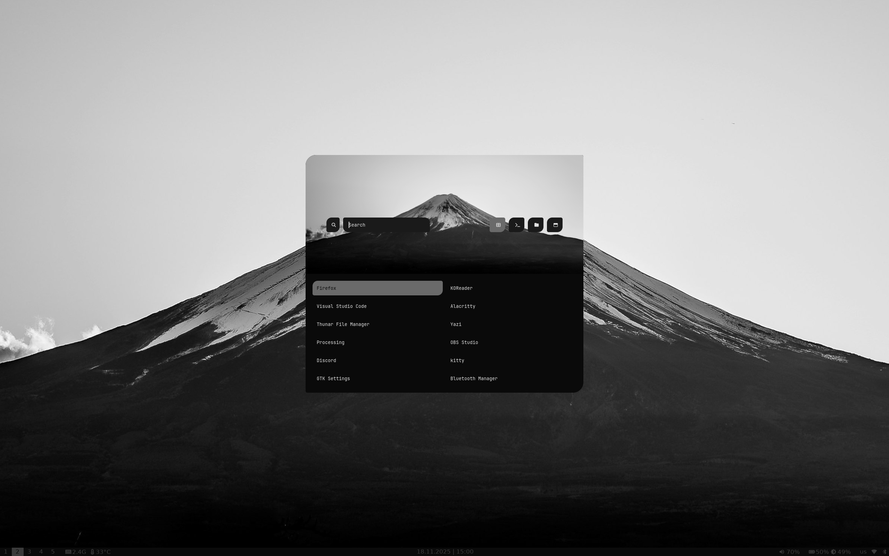
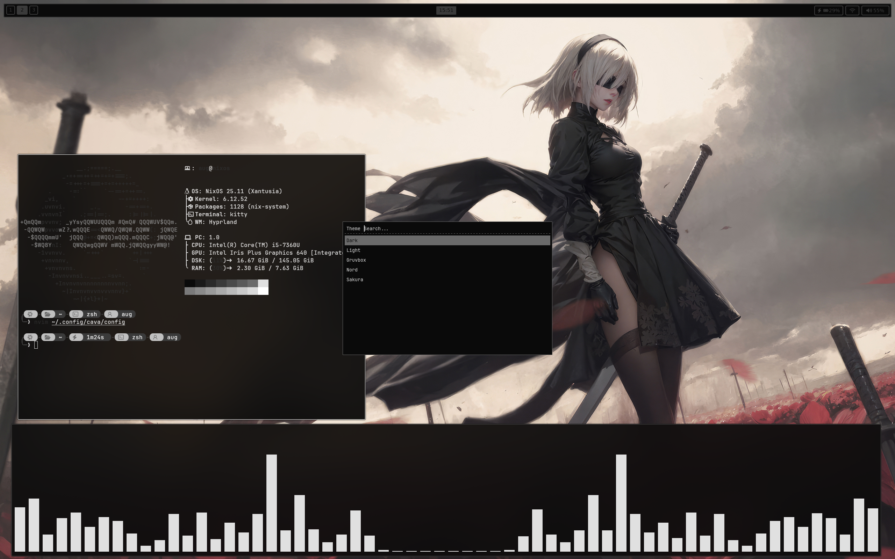
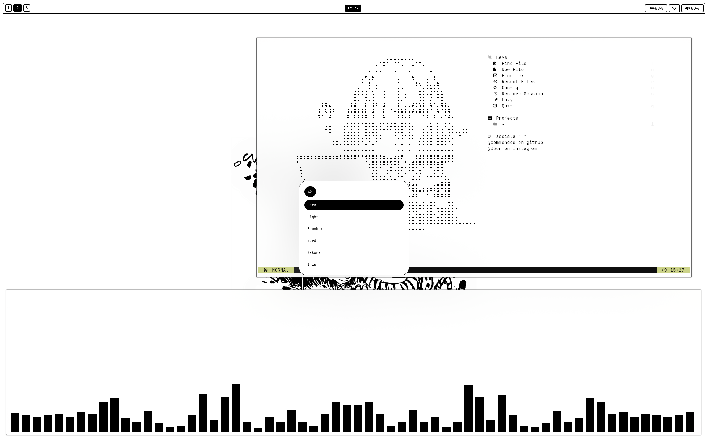
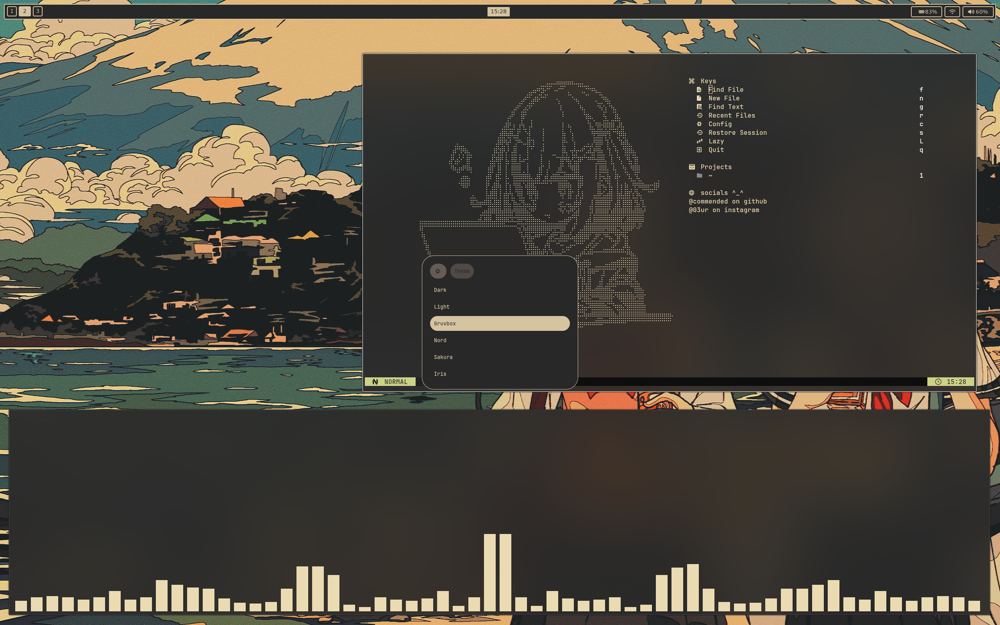
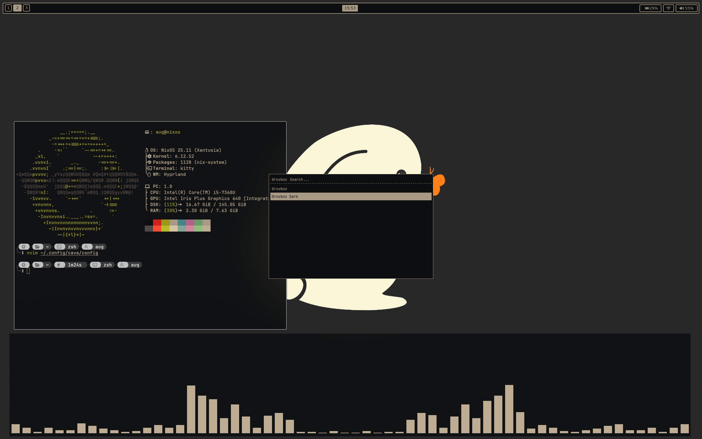
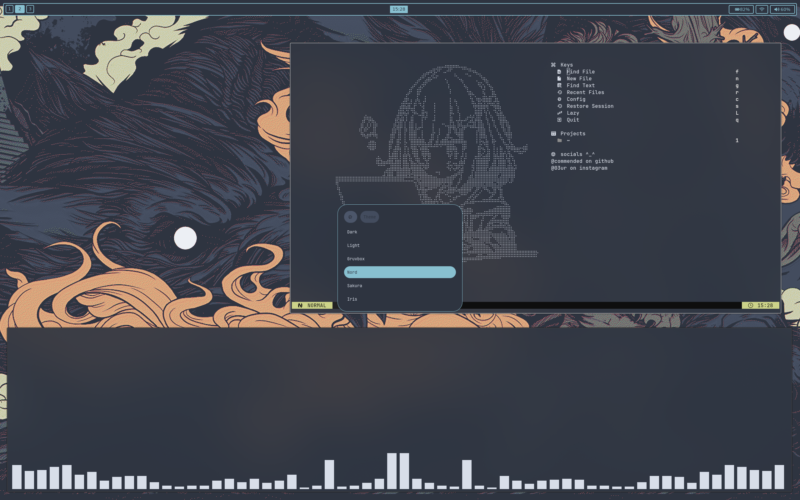
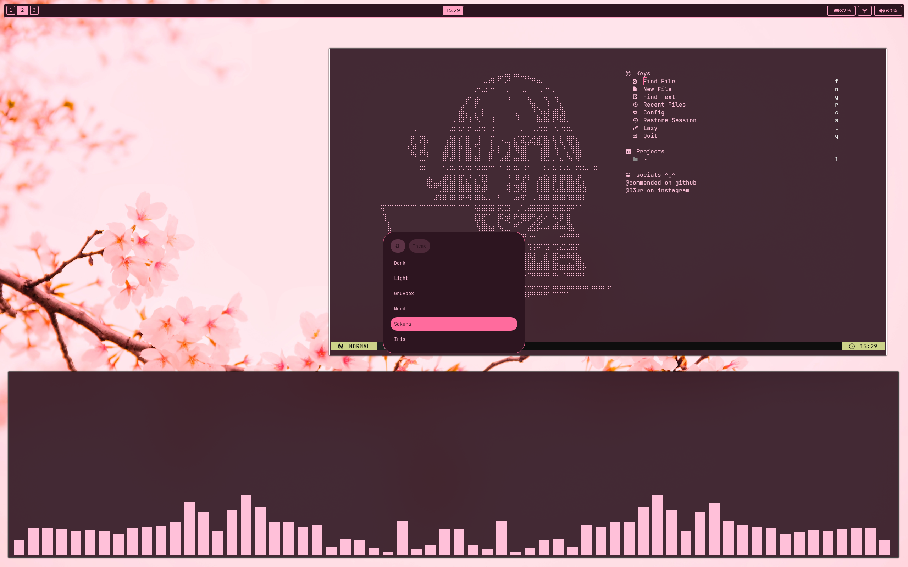
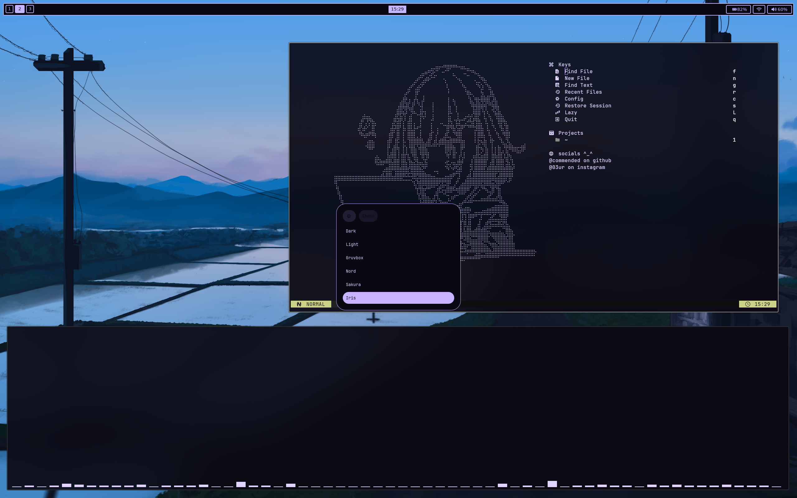

# My Dotfiles

## Showcase

### Screenshots

<table border="0">
  <tr>
    <td></td>
    <td></td>
  </tr>
  <tr>
    <td></td>
    <td></td>
  </tr>
</table>

### Themes

Dark

Light

Gruvbox

Gruvbox Dark

Nord

Sakura

Iris

## Prerequisites

### Required
- hyprland
- waybar
- kitty
- rofi
- zsh
- starship
- nvim
- swww
- pywal (python-pywal)
- brightnessctl
- wireplumber (wpctl)
- grim
- slurp
- ImageMagick (convert command)
- libnotify (notify-send)
- a Nerd Font

### Optional
- fastfetch (system info display)
- rmpc (MPD client)
- yazi (terminal file manager)
- mpd (music player daemon, for rmpc)
- cargo (Rust package manager, if building from source)

## Customization

### Fonts
- Ensure a Nerd Font is installed for proper icon display
- Update font settings in:
  - Kitty: `~/.config/kitty/kitty.conf`
  - Waybar: `~/.config/waybar/config`

### Key Bindings
- Main keybindings are in `~/.config/hypr/config/binds.conf`
- Customize to your preferences

## Troubleshooting

**Icons not displaying?**
- Install a Nerd Font and configure it in your terminal and Waybar

**Waybar not showing?**
- Check if waybar is running: `ps aux | grep waybar`
- Restart: `killall waybar && waybar &`

**Hyprland config errors?**
- Check logs: `hyprctl logs`
- Validate config: `hyprland --check`

**Zsh not loading properly?**
- Make sure Starship is installed: `starship --version`
- Source your config: `source ~/.zshrc`

## Notes

- Some scripts may reference absolute paths - update these to match your system
- Not all components are required, feel free to pick and choose what you need

